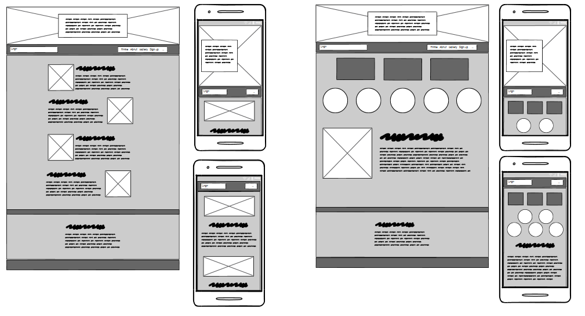

# Strawberry lovers

TODO add: Information about the page

TODO add: Why the page is built

TODO add: Image of how it looks on different screens

## Features

Initial wireframes sketch with 2 basic sketch designs.

TODO add: list with features

- The welcome image
- The navigation bar
- The Main content
- The About us section
- The footer

## Testing

- Tested.

## Bugs

### Solved bugs

- Fixed

### Unfixed bugs

- HTML validation error from meta tag charset

## Technologies used

### Languages
- HTML
- CSS

### Frameworks & Tools

- Git
- GitHub
- Balsamiq
- Google Fonts
- Font Awesome
- Favicon.io
- VS Code
- Mycolor.space
- Compressnow
- Zamzar 
- www.w3schools.com

## Validator Testing

- HTML
- CSS
- Accessibility

## Deployment
Project repository was created from Code Institute template then cloned to my computer using VS code. Changes were continuously pushed back up to Github and then deployed using Github pages.  
Link to live website: [PP1 Strawberry Lovers](https://niclo1337.github.io/pp1-strawberry-lovers/index.html)
## Credits

### Content

### Media

#### Favicon
Photo by Toni Cuenca: [link to image](https://www.pexels.com/photo/strawberry-on-blue-surface-566888/)

#### Main page

 Photo by from Kindel Media: [link to image](https://www.pexels.com/sv-se/foto/bondgard-frukt-vaxter-jordgubbar-7457179/)
  Bild av Aphiwat  chuangchoem: [link to image](https://www.pexels.com/sv-se/foto/mat-halsosam-person-rod-365839/)

Recipes and video from Beryl Shereshewsky: [link to video](https://www.youtube.com/watch?v=UZZ4MuDuvpM)

#### Gallery
Photos by Jonathan Borba: [link to image](https://www.pexels.com/sv-se/foto/flicka-bondgard-lycklig-leende-15672283/), [2nd image](https://www.pexels.com/sv-se/foto/flicka-lantbruk-bondgard-lov-15672380/), [3rd image](https://www.pexels.com/photo/woman-holding-a-freshly-picked-strawberry-15682917/), [4th image](https://www.pexels.com/photo/two-girls-holding-strawberries-on-a-farm-15672326/), [5th image](https://www.pexels.com/photo/man-picking-strawberries-15682920/)
 Photo by David Boozer: [link to image](https://www.pexels.com/photo/strawberries-in-macro-shot-1125121/)
 Photos by Kindel Media: [link to image](https://www.pexels.com/sv-se/foto/person-kvinna-lantbruk-bondgard-7457178/), [2nd image](https://www.pexels.com/sv-se/foto/bondgard-frukt-vaxter-jordgubbar-7457184/), [3rd image](https://www.pexels.com/sv-se/foto/bondgard-staende-leende-jordgubbe-7456823/), [4th image](https://www.pexels.com/sv-se/foto/mat-halsosam-person-hand-7457480/), [5th image](https://www.pexels.com/photo/food-healthy-landscape-man-7457197/)
 Photo by Mochi Mochi: [link to image](https://www.pexels.com/sv-se/foto/flicka-sot-bondgard-vaxter-17710983/)
  Photo by Анна Романченко: [link to image](https://www.pexels.com/sv-se/foto/halsosam-rod-frukt-sot-3186961/)
  Photo by Nataliya Vaitkevich: [link to image](https://www.pexels.com/sv-se/foto/rod-konst-glas-frukt-7184344/)
  Photo by Ngo Tien Quyen: [link to image](https://www.pexels.com/photo/strawberries-in-wig-basket-16221459/)
 Photo by Petra Nesti: [link to image](https://www.pexels.com/photo/strawberries-in-wooden-wicker-basket-on-farm-12775190/)

#### About us
Photo by Gustavo Fring: [link to image](https://www.pexels.com/photo/father-and-daughter-gardening-outdoors-4894606/)

### Code

- Some of the code from the Love Running walkthrough project was used and adapted.

- Was inspired by this beautiful project from a fellow classmate, Sarah-Lee Bester, both from code written and also design. Link to project: [Bro-code](https://taalverena.github.io/bro-code/index.html)

- Took inspiration from Kera Cudmore's very comprehensive README guide: [Readme examples.](https://github.com/kera-cudmore/readme-examples)

- Re-watched this video to make absolute positioning work:
[Learn CSS Position In 9 Minutes](https://www.youtube.com/watch?v=jx5jmI0UlXU&t=18s)

- Re-watched this video to make sticky positioning work:
[The Forgotten CSS Position](https://www.youtube.com/watch?v=NzjU1GmKosQ)